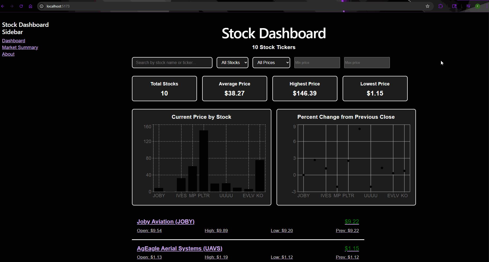

# Stock Analytics Dashboard

Stock Analytics Dashboard is a React application that displays market data for a selected group of stocks using the Finnhub API.

The project expands on a basic stock dashboard by adding dedicated detail pages for individual stocks, unique routes, a persistent sidebar, and data visualizations that help users interpret stock information.

## Features

- Display stock name, ticker symbol, price, opening price, and previous closing price
- Color-code stock prices based on whether they are up or down
- Search and filter stocks from the dashboard
- View summary statistics for the displayed stocks
- Navigate to a dedicated detail page for each stock
- Use unique URLs for individual stock pages
- Maintain the same sidebar across dashboard and detail views
- Display multiple charts based on fetched stock data
- Provide additional stock information on detail pages

## Stock Detail Pages

Each stock in the dashboard links to its own detail page.

The detail view displays additional information that is not shown in the main dashboard and uses a unique URL for each stock.

This structure allows users to navigate directly to a specific stock while keeping the same overall application layout.

## Data Visualizations

The dashboard includes multiple charts created from the fetched stock data.

These visualizations are used to compare different aspects of the displayed stocks and provide a clearer view of the overall dataset.

## How It Works

Stock data is fetched from the Finnhub API using asynchronous requests.

React state is used to manage the fetched data, while routing is used to create separate pages for individual stocks.

The dashboard provides a summary view of the stock data, while each detail page provides additional information for a selected stock.

## Tech Stack

- React
- JavaScript
- CSS
- Finnhub API
- React Router
- React Hooks
- Data Visualization Library

## Demo

## What I Learned

This project gave me more experience building multi-page React applications and presenting API data in different ways.

I also practiced:

- Creating dynamic routes for individual data records
- Building detail pages from API data
- Maintaining shared layout components across routes
- Creating charts from fetched data
- Structuring dashboards with reusable components
- Improving application layout and sidebar design
- Working with asynchronous API requests
